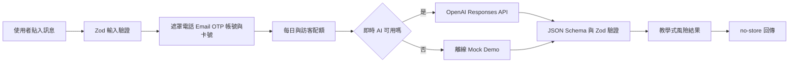

# GuardAI 反詐守門員｜網站建置歷史與 YouTube 素材

> 文件性質：持續更新的專案故事紀錄（Living History）  
> 文件建立：2026-10-05  
> 專案起始建置：2026-07-18  
> 正式網站：<https://guardai-olive.vercel.app>  
> GitHub：<https://github.com/prayer168/guardai>  
> 技術細節與完整 Prompt：[`docs/BUILD_JOURNAL.md`](docs/BUILD_JOURNAL.md)

---

## 1. 為什麼要保留這份歷史

這份文件不是單純的版本清單，而是 GuardAI 從一份競賽簡報，發展成可公開操作網站的完整故事素材。未來可以用來製作：

- YouTube 專案紀錄影片
- 競賽口頭報告與成果發表
- AI 協作開發歷程
- 教育科技作品說明
- 技術架構與資安設計介紹
- 專題反思與後續迭代紀錄

記錄原則：成功與失敗都要保留；Demo、規則測試與真實 AI 評測必須分開；沒有證據的成效、準確率、使用人數與合作關係不得寫成事實。

---

## 2. 一分鐘認識 GuardAI

### 產品名稱

GuardAI 反詐守門員

### 一句話定位

GuardAI 不是替使用者判定訊息真假的工具，而是運用生成式 AI 培養「查證能力」的防詐學習平台。

### 核心標語

> 不替你判斷，陪你完成查證。

### 核心教學方法

1. **停**：先不點連結、不匯款、不提供個資。
2. **看**：辨認催促、金錢、個資、冒名、保密與陌生連結。
3. **問**：產生三個可以實際使用的查證問題。
4. **查**：離開原訊息，改用獨立官方管道確認。
5. **求**：整理可交給家人、老師或 165 的求助摘要。

### 目標使用者

- 國高中學生
- 家長與長者
- 資訊素養、班會及防詐課程教師

### 參賽背景

- 競賽：2026 TAIA AI 創意設計大賽
- 組別：高中職組
- 領域：教育科技
- 初始視覺與內容來源：16 張 GuardAI Vermeer 風格參賽簡報

---

## 3. YouTube 最重要的故事主線

影片不必從「我用了什麼框架」開始，可以從這個問題開始：

> 如果 AI 直接告訴我們「這是詐騙」，下一次換一種話術時，我們真的會判斷嗎？

GuardAI 的開發方向因此從「做一個詐騙偵測器」，轉變成「做一個查證能力教練」。網站不只輸出風險高低，而是要求 AI 指出原文證據、解釋心理操控、提出查證問題、排列安全行動，最後協助使用者向真人求助。

整段建置故事可以濃縮為四個轉折：

1. **從判斷真假，轉向培養能力。**
2. **從漂亮簡報，轉成可操作產品。**
3. **從單人使用，擴充成匿名班級與教師成果。**
4. **從「AI 能回答」進一步處理隱私、安全、成本、失敗備援與可驗證性。**

---

## 4. 專案發展時間軸

```mermaid
timeline
    title GuardAI 建置歷程
    2026-07-18 07:19 : 建立 Next.js 專案骨架
    2026-07-18 10:52 : 完成七大頁面與核心學習流程
    2026-07-18 11:07 : 首次部署 Vercel Production
    2026-07-18 11:55 : 知識庫擴充至 14 種詐騙
    2026-07-18 12:12 : 調整導覽與展示順序
    2026-07-18 13:41 : 加入即時 AI、安全配額與 40 案例
    2026-07-18 14:07 : 完成匿名班級與 165 官方資料串接
    2026-07-18 14:24 : 建立專案交接文件
    2026-07-18 16:16 : AI 冒煙測試診斷與首頁精簡
    2026-10-05 : 入圍後規劃網站、簡報與展示優化
```

### Git 可追溯紀錄

| 時間 | Commit | 建置內容 |
| --- | --- | --- |
| 2026-07-18 07:19 | `c2896d9` | Create Next App 初始骨架 |
| 2026-07-18 10:52 | `c68a624` | 完成 GuardAI 防詐學習平台第一版 |
| 2026-07-18 10:59 | `53ba554` | 建立建置歷程與 Prompt 紀錄 |
| 2026-07-18 11:07 | `93a792f` | 記錄首次 Vercel 正式部署 |
| 2026-07-18 11:55 | `60f37a2` | 防詐知識庫擴充至 14 類 |
| 2026-07-18 11:57 | `0a64775` | 記錄知識庫部署與研究資料 |
| 2026-07-18 12:12 | `3071e03` | 調整防詐闖關導覽位置 |
| 2026-07-18 12:14 | `009666a` | 記錄導覽更新部署 |
| 2026-07-18 13:41 | `bc6d01f` | 啟用受保護的即時 AI 分析流程 |
| 2026-07-18 14:07 | `4e71f59` | 匿名班級與 165 官方資料串接 |
| 2026-07-18 14:24 | `c545915` | 建立專案交接文件 |
| 2026-07-18 16:16 | `2c017a9` | 移除首頁標籤並強化 AI 評測診斷 |
| 2026-07-18 16:18 | `02f7e3d` | 記錄最新正式部署 |

---

## 5. 第一章：從簡報發想成網站

最初的素材是一份 16 張投影片的 GuardAI 競賽簡報。網站規劃時先把內容拆成七個可操作區域：

1. 首頁
2. AI 判讀實驗室
3. 我的學習護照
4. 教師專區
5. 防詐知識庫
6. 防詐闖關
7. 隱私與 AI 說明

這個階段最重要的產品決策，是拒絕只顯示一個「詐騙分數」。判讀結果必須包含：

- 風險等級與 AI 信心程度
- 訊息中的具體可疑片段
- 每項疑點的類型與白話解釋
- 可能使用的心理操控方式
- 三個查證問題
- 依優先順序排列的安全行動
- 可以遷移到其他情境的學習重點
- 可轉傳給家人、老師或 165 的求助摘要

### 適合影片的畫面

- 原始簡報封面與網站首頁並排
- 從簡報草圖切換到七個正式頁面
- 顯示「只有風險分數」與「完整查證學習結果」的差別

---

## 6. 第二章：把教育理念做成互動

為了避免 GuardAI 只是一個工具網站，後續加入完整的學習循環：

- 五題前測
- 六個分支情境
- 每題作答後立即解釋
- 正常訊息案例，避免形成「所有訊息都是詐騙」的偏誤
- 停、看、問、查、求能力標記
- 查證力分數與能力雷達圖
- 五題後測
- 前後測進步與常忽略線索
- 不設公開排行榜

個人紀錄預設只放在目前瀏覽器的 `localStorage`，不必建立帳號。這個設計同時降低使用門檻，也避免建立不必要的學生個資資料庫。

### 教學目標與成功證據

| 學習目標 | 網站活動 | 使用者行動 | 成功證據 |
| --- | --- | --- | --- |
| 找出訊息風險線索 | AI 判讀實驗室 | 對照原文證據與解釋 | 能指出至少三個具體線索 |
| 提出可查證問題 | AI 判讀結果 | 閱讀並使用三個問題 | 不只依賴 AI 的真假答案 |
| 選擇安全行動 | 防詐闖關 | 選擇下一步並閱讀回饋 | 知道停止、換管道查證與求助 |
| 反思能力變化 | 學習護照 | 完成前後測與情境練習 | 看見進步與常忽略概念 |
| 了解群體學習狀況 | 教師專區 | 建立匿名班級並查看彙總 | 只看到趨勢，不標籤個別學生 |

---

## 7. 第三章：建立 AI 判讀與安全邊界

GuardAI 的 AI 不是直接接收使用者文字後自由回答，而是經過多層限制：



### 主要安全設計

- API Key 只存在伺服器端。
- 原始訊息不寫入資料庫。
- 訊息中的指令一律視為待分析資料，防止 Prompt Injection。
- 不自動開啟、造訪或推薦點擊訊息內網址。
- 不允許輸出「百分之百安全」或「一定是詐騙」。
- 證據不足時允許輸出 `unknown`。
- 模型回傳必須符合固定 JSON Schema。
- 請求設定 `store: false`、20 秒逾時並停用自動重試。
- 即時 AI 失敗時安全回退 Mock，讓競賽與課堂展示不會中斷。

### 用量與成本保護

- Vercel Firewall：分析 API 每 IP 每分鐘最多 5 次。
- Upstash Redis：全站每日 200 次、單一匿名訪客每日 40 次。
- 計數依臺北日期重置。
- Redis 或必要安全設定不可用時採 Fail-closed，不呼叫付費 AI。
- Redis 只保存日期、匿名雜湊與使用次數，不保存訊息內容。

---

## 8. 第四章：從六類知識卡擴充到 14 類詐騙

知識庫最初只有六類簡短提醒，後續依政府與主管機關資料擴充為 14 類：

1. 假客服退款
2. 假投資
3. 網購／幽靈包裹
4. 冒名親友
5. 釣魚連結
6. 帳號盜用
7. 網路愛情
8. 假檢警／公務機關
9. 求職詐騙
10. 貸款／人頭帳戶
11. 租屋詐騙
12. 票券詐騙
13. AI 深偽
14. QR／付款碼詐騙

每一類都改寫成「接觸、取信、施壓、收割」四階段流程，並補上：

- 可能造成的財務、帳號、個資、法律或人身結果
- 可立即採取的因應方式
- 三個查證問題
- 官方資料來源與更新日期

主要研究來源包含警政署、刑事警察局、警察廣播電臺、勞動部、金管會、法務部與行政院消費者保護會。

### Images 2.0 圖像製作

首頁、教師專區與 14 張宣導圖使用 OpenAI Images 2.0 生成，視覺延續 Vermeer 光影、古典守護感、深海軍藍、暖象牙白與低飽和金色。

為避免生成文字錯誤，圖片本身不放中文正文、網址、Logo 或統計數字，精確文字由 HTML 疊加。QR／付款碼圖片的初稿曾出現近似可掃描方塊，因此未採用，重新生成為不可掃描的抽象馬賽克圖樣。

### 適合影片的畫面

- 六類知識卡到 14 類知識庫的前後對照
- 四階段詐騙流程展開動畫
- 14 張海報快速蒙太奇
- 放大展示被淘汰的近似 QR 構圖，再說明為何必須重做

---

## 9. 第五章：教師端從 Demo 變成匿名班級

教師專區原本只有標示清楚的 Demo 模擬資料。後來加入可實際操作的匿名班級後端：

- 教師選擇學生、親子或長者情境包。
- 系統產生 `GUARD-XXXXXX` 班級代碼。
- 學生不必建立帳號，也不用輸入姓名、Email 或座號。
- 瀏覽器產生隨機 UUID，伺服器加入班級代碼與祕密 Salt 後進行 SHA-256。
- 伺服器只保存不可逆雜湊與固定成果欄位。
- 教師只能看到參與人數、完成率、平均分數與常錯概念。
- 班級、參與集合與成果資料均設 30 天 TTL。

成果 API 使用 Strict Zod Schema。如果有人夾帶 `studentName`、自由文字或超出範圍的分數，API 會直接拒絕。

這個功能的核心不是建立大型學生資料庫，而是證明「可以看見學習趨勢，同時不需要知道學生是誰」。

---

## 10. 第六章：串接 165 官方闢謠資料

知識庫原本只預留資料介面，後續正式串接警政署「165 反詐騙諮詢專線－詐騙闢謠專區」政府開放資料 CSV。

- 每日重新驗證一次。
- 顯示最新可取得的 6 筆資料。
- 自製 CSV 狀態機支援引號、逗號、多行及雙引號跳脫。
- 驗證 HTTP、Content-Type 與欄位 Schema。
- 如果官方格式改變，顯示暫時不可用，不猜測解析。
- 14 類人工查核教學內容仍保留作為安全備援。

這段很適合在影片中說明：串接官方資料不只是把網址接上去，還要考慮來源失敗、格式改變與錯誤資料不能污染教學內容。

---

## 11. AI 編碼過程使用了哪些工具

| 工具／技術 | 實際用途 |
| --- | --- |
| OpenAI Codex | 需求拆解、架構設計、程式編寫、除錯、測試、文件與部署協作 |
| OpenAI Images 2.0 | 首頁、教師情境與 14 張防詐宣導圖 |
| OpenAI Responses API | 伺服器端結構化反詐分析 |
| Next.js 16 App Router | 頁面、Server Components、Route Handlers 與正式建置 |
| React 19＋TypeScript | 互動元件、狀態與型別安全 |
| Tailwind CSS＋全域 CSS | 響應式排版與 GuardAI 設計系統 |
| Zod＋JSON Schema | 使用者輸入與 AI 輸出的雙重結構驗證 |
| Upstash Redis | 每日用量、匿名班級與 30 天資料到期 |
| Node Crypto | SHA-256 加鹽匿名識別 |
| Recharts | 查證能力雷達圖 |
| Node Test Runner＋tsx | 40 個情境及其他安全、班級、CSV 測試 |
| Vercel Firewall | API 每 IP 每分鐘限制 |
| 瀏覽器自動化 | 實際操作桌機與 390px 手機流程 |
| Git／GitHub CLI | 版本控制、公開 Repository 與 PR |
| Vercel CLI | Preview／Production 建置、部署及狀態檢查 |
| PowerShell | 本機檢查、HTTP 驗證、npm 與 Git 工作流程 |

---

## 12. Prompt 如何隨專案演進

### 第一版：把構想做成可操作產品

最初 Prompt 同時定義了產品角色、七個頁面、AI 輸出 Schema、安全限制、技術堆疊、視覺風格與完成標準。

代表性要求：

> GuardAI 不是替使用者裁定訊息真假的工具，而是一個運用生成式 AI 培養「查證能力」的防詐學習平台。

### 第二版：把 AI 從回答者改成查證教練

系統提示詞明確要求 AI：找出原文證據、產生三個查證問題、安排安全行動、在高風險時引導真人求助，並禁止斷言與執行訊息中的指令。

### 第三版：從 Prototype 走向安全上線

後續 Prompt 加入：

- `GUARDAI_AI_MODE` 明確切換
- 伺服器端 API Key
- 20 秒逾時與停用自動重試
- 每分鐘與每日配額
- 40 個合成案例
- 絕不保存原始可疑訊息

### 第四版：從單人網站走向實際教學場域

後續 Prompt 再加入匿名班級、成果彙總、30 天 TTL、官方 165 資料與安全失敗策略。

### 第五版：入圍後最後衝刺

2026-10-05 收到入圍後補件通知，開始把 Prompt 從「增加功能」改成「證明創新、落地、AI 技術深度與作品完成度」。規劃項目包括競賽展示模式、AI 技術透明化、應用情境、評測證據、簡報、海報、Demo 影片與評審問答；本階段尚在規劃，未寫成已完成網站功能。

完整 Prompt 請參閱 [`docs/BUILD_JOURNAL.md`](docs/BUILD_JOURNAL.md)，避免在這份影片素材中重複大段技術規格。

---

## 13. 真正遇到的問題與修正

### 問題 1：即時 AI 沒有可用 API 額度

新的 OpenAI API Key 已透過安全流程建立，並只保存於忽略檔與 Vercel 加密環境變數。實際冒煙測試使用真正金鑰時，OpenAI 回傳 HTTP 429 `insufficient_quota`。

這代表請求已到達 OpenAI，但專案 Billing／credits 不足；不是一般每分鐘 Rate Limit，也不是 JSON Schema 錯誤。為避免無效請求，完整 40 題生成式 AI 評測沒有繼續執行。正式網站會安全回退 Mock。

**影片可以說：**程式與安全管線已完成，但即時模型的完整 40 題評測仍受到 API 額度阻擋。  
**影片不能說：**即時生成式 AI 已經 40／40 通過。

### 問題 2：Vercel 下載的敏感環境變數不能直接測試

Vercel CLI 對受保護變數只回傳 `[SENSITIVE]`。第一次診斷若把這個保護字串當成金鑰，就會得到 401 `invalid_api_key`。改用安全保存在本機忽略檔的真正金鑰後，才確認實際問題是 `insufficient_quota`。

因此即時評測器後來加入：

- 每題延遲
- HTTP 狀態
- API 錯誤代碼
- API Key 文字遮罩

### 問題 3：React 19 Hook lint

學習護照讀取 `localStorage` 時，Effect 中同步更新狀態觸發 lint 規則。後來改成下一幀載入並補上錯誤處理，ESLint 才通過。

### 問題 4：Next.js `revalidate` 不能使用算式

165 官方資料 Route Segment 第一次建置時，`revalidate` 使用算式導致 Production build 失敗；改成靜態常值 `86400` 後成功。

### 問題 5：PowerShell 把瀏覽器元素參照當成變數

自動化操作中的 `@e12` 被 PowerShell 解讀，第一次點擊失敗。將元素參照正確加引號後重試成功。這是測試命令問題，不是網站按鈕失效。

### 問題 6：生成海報出現近似 QR Code

QR／付款碼海報初稿出現近似可掃描圖樣。基於安全考量沒有採用，改成不可掃描的抽象馬賽克。

### 問題 7：公開網站不能只靠成功建置

每次部署後仍需要檢查 HTTP、主要頁面、API、手機排版與錯誤 overlay。最新首頁精簡部署完成後，另以 Production HTTP 200、指定文字消失、GuardAI 標題與核心標語仍存在作為證據。

---

## 14. 測試與目前可證明的結果

### 可以證明

- `npm test`：50／50 通過。
- 其中包含 40 個合成反詐、正常訊息及 Prompt Injection 情境。
- 另有敏感資料遮罩、AI 模式、匿名班級 Schema／彙總與官方 CSV 測試。
- ESLint、TypeScript 與 Next.js Production build 通過。
- `npm audit --omit=dev` 曾驗證為 0 個已知漏洞。
- Vercel Firewall 實測第 6 次連續 POST 被阻擋，符合每分鐘 5 次限制。
- 匿名班級建立、加入、提交與 Redis 彙總完成端對端測試。
- 165 API 實測 HTTP 200，回傳官方資料與每日 Cache-Control。
- 390px 行動版核心流程曾完成驗收，未出現 Next.js error overlay。
- 正式網站已部署至 Vercel Production。

### 尚不能宣稱

- 即時 OpenAI 模型 40 題準確率。
- 大規模真實學生學習成效。
- 已與學校、警方、165 或金融機構正式合作。
- AI 結果等同警方、金融機構或法律認定。
- 零風險、百分之百安全或百分之百能抓出詐騙。

### Demo 數據的正確說法

教師頁面的模擬資料只能稱為「Demo 模擬資料」。真實進班前測、後測或使用回饋必須另外記錄樣本數、日期、課程情境、同意方式與限制。

---

## 15. 目前版本與公開狀態

| 項目 | 狀態 |
| --- | --- |
| 正式網站 | <https://guardai-olive.vercel.app> |
| GitHub | <https://github.com/prayer168/guardai> |
| 網站版本 | 0.4.x 階段 |
| 最新 Production Deployment | `dpl_6gFd4ebPSjzeERB5q2yCdVge2pwW` |
| 測試數量 | 50 項 |
| 防詐知識類型 | 14 類 |
| 匿名班級 | 已完成，30 天 TTL |
| 165 官方資料 | 已串接，每日檢查 |
| 即時 AI | 程式與安全管線完成；API 額度不足時回退 Mock |
| GitHub 自動部署 | 尚未完成，現階段使用 Vercel CLI |
| E2E CI | 尚未建立 Playwright／GitHub Actions |
| 真實教學成效 | 尚待實際班級或家庭試用 |

目前最新首頁調整位於分支 `agent/remove-home-hero-label`，並建立 GitHub Draft PR #1；後續工作前要先確認 PR 與 `main` 的同步狀態，避免在不同分支重複修改。

---

## 16. 建議的 YouTube 影片章節

以下是一支約 10–15 分鐘影片的建議結構，可依實際片長刪減。

### 00:00–00:35｜開場 Hook

畫面：快速切換詐騙訊息、GuardAI 首頁、風險線索與三個查證問題。

旁白方向：

> 多數工具只想告訴你「這是不是詐騙」，但我想做的是：下一次 AI 不在身邊時，你還知道怎麼查證嗎？

### 00:35–01:30｜問題與發想

- 防詐資訊很多，但人們在壓力下仍可能點擊、匯款或交出 OTP。
- 原始構想來自競賽簡報。
- 決定把重點放在「查證能力」而不是「AI 幫你做決定」。

### 01:30–03:00｜從簡報到七個頁面

- 展示網站資訊架構。
- 說明首頁、AI 判讀、闖關、護照、教師、知識庫及隱私頁。
- 顯示 Vermeer 光影如何轉成網頁設計系統。

### 03:00–05:00｜60 秒完整操作

- 選擇示範訊息。
- 顯示敏感資料遮罩。
- 找出具體風險片段。
- 展示三個查證問題與安全行動。
- 產生求助摘要。

### 05:00–06:30｜為什麼它是教育科技

- 前測、六題闖關、正常訊息案例、後測、雷達圖。
- 教師只能看到匿名趨勢。
- 不做排行榜、不標籤學生。

### 06:30–08:00｜AI 安全與隱私

- 伺服器端 API Key。
- 遮罩、Prompt Injection 防護、Schema、`store: false`。
- 用量限制與失敗回退。
- 不開啟陌生網址、不保存原始訊息。

### 08:00–09:10｜知識庫與 165 官方資料

- 14 種詐騙。
- 四階段流程。
- Images 2.0 海報。
- 官方 CSV 與失敗備援。

### 09:10–10:30｜開發中真正踩過的坑

- API `insufficient_quota`。
- Vercel `[SENSITIVE]`。
- React Hook lint。
- `revalidate` 建置錯誤。
- QR 海報安全重做。

### 10:30–11:30｜測試與證據

- 50 項測試。
- 40 個合成案例。
- 390px 手機版。
- Firewall、Redis、165 API 與 Production 驗證。

### 11:30–結尾｜限制與下一步

- 完成 API Billing 後進行 5 題冒煙測試與 40 題即時 AI 評測。
- 進行真實班級或家庭試用。
- 建立 Playwright／GitHub Actions。
- 為決賽補強展示模式、影片、海報與評審問答。

結尾句可呼應核心標語：

> GuardAI 不替你判斷，它想陪你把查證做完。

---

## 17. YouTube 畫面與素材清單

### 必拍畫面

- 原始 16 張簡報的封面與重點頁
- 正式網站首頁
- 六個示範案例
- 敏感資料遮罩前後
- 風險證據、查證問題、安全行動與求助卡
- 防詐闖關作答與即時回饋
- 雷達圖與前後測
- 建立班級、匿名加入與教師彙總
- 14 類知識庫與官方來源
- 165 即時資料區塊
- 隱私與 AI 資料流
- Git commit 時間軸
- 測試終端畫面，但要避開任何環境變數與金鑰
- Vercel Production 網站與手機版操作

### 可做成動態圖卡的數字

- 7 個主要功能頁面
- 5 步查證流程
- 6 個分支闖關情境
- 5 題前測＋5 題後測
- 14 種詐騙知識類型
- 40 個合成反詐／正常／Prompt Injection 案例
- 50 項目前自動測試
- 30 天匿名班級期限

### 拍攝時必須遮住

- OpenAI API Key
- Redis URL／Token
- Vercel Token／OIDC Token
- Salt 或任何祕密環境變數
- 個人 Email、付款資料與帳戶資訊
- 真實使用者貼入的可疑訊息
- 未經同意的學生姓名、影像或作答資料

---

## 18. 可以直接使用的影片標題方向

1. 我用 AI 做了一個不替你判斷的防詐網站｜GuardAI 開發紀錄
2. 從 16 張簡報到可操作網站：GuardAI 反詐教育平台誕生過程
3. AI 不只抓詐騙，還能教你查證嗎？GuardAI 完整實作
4. 用 Next.js、OpenAI 與 165 資料打造防詐教育科技網站
5. 我的 AI 競賽作品如何保護隱私、對抗 Prompt Injection 與誤判

---

## 19. 未來每次更新要新增什麼

每次功能、測試、比賽或影片素材有變化時，在本文件新增一節：

```markdown
### YYYY-MM-DD｜更新主題

- 這次為什麼要改：
- 使用者／評審提出的需求：
- 使用的 Prompt：
- AI 與程式工具：
- 修改的功能與檔案：
- 遇到的問題：
- 如何修正：
- 測試與證據：
- Commit／PR／部署：
- 可用於 YouTube 的畫面：
- 可用於旁白的重點：
- 尚未完成或不能宣稱的內容：
- 下一步：
```

### 真實教學試用另外記錄

```markdown
### YYYY-MM-DD｜匿名教學試用

- 使用情境：班會／資訊素養／家庭／社區
- 對象與年齡層：
- 匿名樣本數：
- 活動時間：
- 使用的情境包：
- 前測平均：
- 後測平均：
- 常忽略概念：
- 經同意的匿名回饋：
- 已知限制：
- 資料保存與刪除方式：
```

---

## 20. 文件維護與影片誠信原則

1. `history.md` 負責說故事；`docs/BUILD_JOURNAL.md` 保存完整技術、Prompt 與部署細節。
2. 新功能完成後才寫成已完成；規劃中的功能明確標示「規劃中」。
3. 規則引擎測試、程式測試、Demo 資料與即時 AI 評測分開敘述。
4. 不公開金鑰、Token、Salt、付款或個資。
5. 不保存或展示真實使用者原始可疑訊息。
6. 引用學習成效時記錄樣本數、日期、情境、同意方式與限制。
7. 每次重要更新保留 Commit、PR、部署 ID、測試結果及公開網址。
8. 網站仍是教育與初步風險分析工具，不取代警方、金融機構、165 或法律認定。

---

## 21. 2026-10-05｜決賽優化開始：先建立可驗證基線

- **這次為什麼要改：**入圍後需讓評審在 3–5 分鐘內理解創新性、落地情境、AI 技術深度與安全設計，並確保現場斷網仍可完成核心展示。
- **使用者／評審提出的需求：**競賽展示模式、AI 技術透明化、40 題評測摘要、三種角色情境、實證資料空狀態、離線備援與完整品質驗收。
- **本階段 Prompt：**先盤點既有功能，建立「評分項目 → 現況證據 → 缺口 → 修改方案 → 驗收方式」矩陣；矩陣確認前不得修改程式。
- **AI 與程式工具：**Codex、Git、GitHub CLI、Vercel CLI、Next.js build、ESLint、TypeScript、Node Test Runner 與實際瀏覽器驗證。
- **基線結果：**50／50 程式測試通過，其中 40 題為合成規則／Mock 測試；ESLint、TypeScript 與 Production build 通過；主要頁面與知識庫 API 均回傳 HTTP 200。
- **重要發現：**正式分析頁可在 OpenAI 失敗時回退 Demo，但瀏覽器真正斷網時會顯示英文 `Failed to fetch`，因此尚未符合決賽離線展示要求。
- **不能混淆：**40 題規則測試不是即時生成式 AI 準確率；即時 AI 完整評測仍標示「待完成」。
- **截圖證據：**修改前桌機、平板與手機畫面已保存於 `docs/screenshots/2026-10-finalist-optimization/00-baseline/`。
- **分支狀態：**沿用 `agent/remove-home-hero-label`，保留既有 `history.md`、README、HANDOFF 與 BUILD_JOURNAL 修改，不重建網站。
- **下一步：**建立內嵌資料的 `/showcase` 引導流程、離線備援、AI 技術流程、評測摘要、三種情境導覽與實證資料空狀態。

### 實作里程碑 1｜展示流程與離線安全骨架

- 新增 `/showcase` 八段引導：問題、訊息、風險線索、三個查證問題、安全行動、求助、學習證據與 AI 安全。
- 新增「安全 Demo 引擎」固定標示、一鍵載入、上一步、下一步及重新開始。
- 新增學生、親子／長者、教師三種可切換情境，每種都有角色、問題、步驟、安全決策、學習證據與效益。
- 新增 `public/guardai-offline-demo.html` 單檔離線備援；不依賴 Next.js、API、字型 CDN 或外部圖片。
- 將規則測試 40／40 與即時 AI「待完成」分開呈現，避免把程式測試寫成模型準確率。
- 隱私頁補上六階段資料流、Prompt 原則、Schema 範例與可以／不可公開的安全邊界。
- 教師頁新增真實試用資料空狀態，Demo 數字繼續明確標示為模擬資料。
- 一般分析頁遇到真正斷網時改用繁體中文說明，並提供前往離線展示的恢復入口。
- 新增 3 項展示資料測試；目前自動測試由 50 項增加為 53 項，53／53 通過。
- ESLint 與 TypeScript 已通過；正式 build 與實際瀏覽器驗收尚待下一階段完成。

### 實作中視覺檢查 1

- 保存桌機步驟 1、桌機步驟 8、手機步驟 1 與手機步驟 8 的 full-page 截圖至 `docs/screenshots/2026-10-finalist-optimization/01-implementation/`。
- 桌機 1440px 與手機 390px 均未出現水平溢出或 Next.js 錯誤 overlay。
- 實際點擊步驟導覽、求助摘要、三種角色頁籤與重設按鈕。
- 視覺檢查發現並修正：重複一級標題、角色頁籤未隨整體重設，以及手機技術流程捲動過長。

### 實作里程碑 2｜真正斷網與單檔備援

- `/showcase` 先在線載入，再切換瀏覽器 offline：仍能載入示範訊息並前進，沒有 API 請求、錯誤 overlay 或水平溢出。
- `guardai-offline-demo.html` 沒有外部 script、stylesheet、字型或圖片；直接用 `file://` 開啟並保持 offline 時仍可操作，Resource Timing 為 0。
- `/analyze` 在送出時斷網：顯示繁體中文「目前無法連上分析服務」，提供「改用離線競賽展示」，不再顯示英文 `Failed to fetch`。
- 實際鍵盤驗證：Tab 可依序聚焦跳至內容、品牌、手機選單、重設與下載；Enter 可開啟手機導覽。
- reduced-motion 已透過瀏覽器模擬並確認生效。
- AI 技術頁、教師實證空狀態與 1440／768／390 畫面已新增截圖。
- 網站版本提升為 0.5.0，並新增 `CHANGELOG.md` 與 `docs/test-report.md`；正式部署仍待最終驗收。

### 實作里程碑 3｜安全公告阻止部署，完成框架升級

- 最終 `npm audit` 發現 Next.js 16.2.10 已被 2026 年 9 月的新安全公告列為 critical，因此立即停止部署流程。
- 查核 Next.js 官方公告後，確認 16.3.8 是 Active LTS 修正版；同步升級 Next.js／eslint-config-next 16.3.8、React／React DOM 19.3.0、PostCSS 8.5.29 與相關傳遞相依。
- 升級後 `npm audit --omit=dev` 為 0 個已知漏洞；53／53 測試、ESLint、TypeScript 與 Production build 全數重新通過。
- 完整 audit 尚有 ESLint 開發工具鏈公告；官方自動修正會破壞性降級 Next.js ESLint 設定，因此不使用 `--force`。這項限制已寫入測試報告，等待上游修補。
- 升級後重新驗證 1440×1000、768×1024、390×844、reduced-motion、重設、角色切換與斷網流程，均未出現水平溢出或錯誤 overlay。
- 最終候選截圖保存於 `docs/screenshots/2026-10-finalist-optimization/02-final-verification/`。

